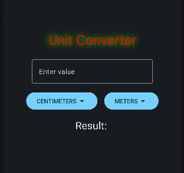
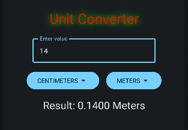

# Simple Unit Conversion App

This app was created to help me learn more about Jetpack Compose and Android development in general.

In this project, I explored the following concepts:

- **State Variables in Kotlin**
- **Anonymous Functions**
- **Jetpack Compose Components (Spacer, Icon, and DropdownMenu)**
- **Basic Styling**
- **Enum Classes in Kotlin**

Some images of app:

Note: This is a simple project designed to help me practice Kotlin and Android development, which is why it's kept basic.